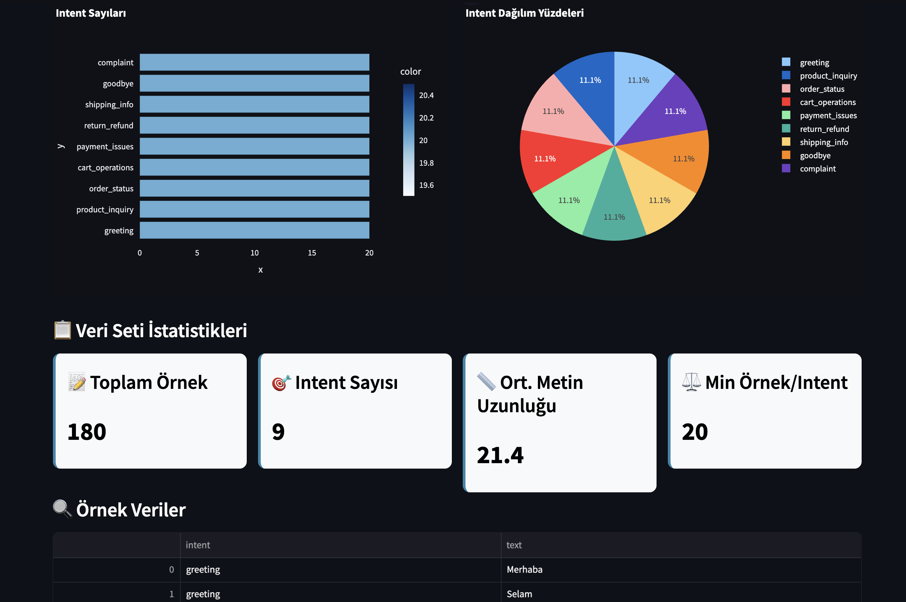

# 🛍️ E-Ticaret Chatbot Projesi

Bu proje, e-ticaret müşteri hizmetleri için geliştirilmiş yapay zeka destekli bir chatbot uygulamasıdır. Hugging Face ve Google Gemini modelleriyle geliştirilmiştir.

Proje Özeti

E-ticaret platformları için müşteri sorularını yanıtlayan, sipariş takibi yapan ve ürün önerileri sunan akıllı chatbot sistemi. Intent classification kullanarak kullanıcı mesajlarını doğru kategorilere ayırır ve uygun yanıtlar üretir.

Chatbot Yetenekleri

### Ana Intent'ler:
- **Greeting** - Selamlama ve karşılama
- **Product_Inquiry** - Ürün sorgulaması ve bilgi alma  
- **Order_Status** - Sipariş durumu takibi
- **Cart_Operations** - Sepet işlemleri (ekleme, çıkarma, görüntüleme)
- **Payment_Issues** - Ödeme sorunları
- **Return_Refund** - İade ve geri ödeme
- **Shipping_Info** - Kargo ve teslimat bilgileri
- **Goodbye** - Vedalaşma
- **Complaint** - Şikayet ve sorun bildirme

Proje Yapısı

```
├── data/
│   └── ecommerce_dataset.csv     # 180 satır eğitim veri seti (9 intent)
├── models/
│   ├── huggingface_model.py     # Hugging Face Transformers modeli
│   ├── gemini_model.py          # Google Gemini modeli
│   └── traditional_ml_model.py  # Geleneksel ML karşılaştırması
├── app/
│   └── streamlit_app.py         # Web arayüzü ve karşılaştırma paneli
├── evaluate_models.py           # Model değerlendirme scripti
├── README.md
└── requirements.txt
```

Kurulum

1. Gerekli paketleri yükleyin:
```bash
pip install -r requirements.txt
```

2. Google Gemini API anahtarını alın:
   - https://makersuite.google.com/app/apikey adresinden ücretsiz API key alabilirsiniz

3. Uygulamayı çalıştırın:
```bash
streamlit run app/streamlit_app.py
```

4. Tarayıcıda `http://localhost:8501` adresine gidin

Model Performansı

**Test Verisi:** 36 örnek (%20 split), 20 örnek ile değerlendirme

| Model        | Accuracy | Precision | Recall | F1 Score | Özellikler                            |
|--------------|----------|-----------|--------|----------|---------------------------------------|
| Gemini       | 0.70     | 0.85      | 0.70   | 0.71     | Few-shot learning, prompt engineering |
| Hugging Face | 0.25     | 0.11      | 0.25   | 0.15     | Zero-shot classification, ücretsiz    |

**Sonuç Analizi:**
- **Gemini** prompt engineering sayesinde %280 daha iyi accuracy elde etti
- **Few-shot learning** tekniği Türkçe e-ticaret terminolojisinde çok etkili oldu
- **Ücretsiz Hugging Face** modeli sınırlı performans gösterdi 

Örnek Konuşmalar

Başarılı Gemini Örnekleri:

**Kullanıcı:** "Ürün arıyorum"  
**Gemini:** "Ürün kataloğumuzdan size en uygun seçenekleri bulabilirim."  
Intent: product_inquiry | Güven: 0.98

**Kullanıcı:** "Sepete ekle"  
**Gemini:** "Sepet içeriğinizi istediğiniz şekilde düzenleyebiliriz."  
Intent: cart_operations | Güven: 1.00

**Kullanıcı:** "Hoşçakal"  
**Gemini:** "Alışveriş yapmak için tekrar görüşmek üzere! İyi günler dileriz."  
Intent: goodbye | Güven: 1.00

## Arayüz Özellikleri

- Chat Sekmesi: Gerçek zamanlı sohbet
- Veri Analizi: Intent dağılımı ve istatistikler  
- Model Karşılaştırma: Otomatik performans testi
- Performans: Detaylı metrikler ve grafikler

Ekran Görüntüleri

Chat Arayüzü


Veri Analizi Sekmesi


Model Karşılaştırması


